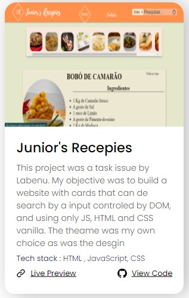

[![Contributors][contributors-shield]][contributors-url]
[![Forks][forks-shield]][forks-url]
[![Stargazers][stars-shield]][stars-url]
[![Issues][issues-shield]][issues-url]
[![MIT License][license-shield]][license-url]
[![LinkedIn][linkedin-shield]][linkedin-url]

<!-- PROJECT LOGO -->
 

  

<h3 align="center">Web Portfolio</h3>

  

    A project using JavaScript, CSS and HTML Vanilla.
     
    <a href="https://github.com/Afmjuniors/portifolio"><strong>Explore the docs »</strong></a>
     
     
    <a href="https://afmjuniors.github.io/portifolio/">View Demo</a>
    ·
    <a href="https://github.com/Afmjuniors/portifolio/issues">Report Bug</a>
    ·
    <a href="https://github.com/Afmjuniors/portifolio/issues">Request Feature</a>
  

<!-- TABLE OF CONTENTS -->

  
Table of Contents

  <ol>
    <li>
      <a href="#about-the-project">About The Project</a>
      <ul>
        <li><a href="#built-with">Built With</a></li>
      </ul>
    </li>
    <li>
      <a href="#getting-started">Getting Started</a>
    </li>
    <li><a href="#usage">Usage</a></li>
    <li><a href="#contact">Contact</a></li>
    <li><a href="#acknowledgments">Template Design</a></li>
  </ol>

<!-- ABOUT THE PROJECT -->
## About The Project

![Product Name Screen Shot][product-screenshot]

This Web Portfolio was a project that was given by Labenu in their bootcamp.
Creating a website with only the fundamentals, HTML, CSS and JavaScript, in my mind, is ecessinatial to create a solid fundation for future development in anyway tools and languages necessary in the future.

The design was provided by the institution before hand, and my priority was to follow said template.

(<a href="#readme-top">back to top</a>)

### Built With

* ![HTML][html-badge]
* ![CSS][css-badge]
* ![JS][js-badge]

(<a href="#readme-top">back to top</a>)

<!-- GETTING STARTED -->
## Getting Started

To run this site localy you have only to fork this repository and open the intex.html file in your browser.

(<a href="#readme-top">back to top</a>)

<!-- USAGE EXAMPLES -->
## Usage

This Website was developt to be a resume, where its possible to view all my basic information.
I will make sure to keep it up to date.
The page projects will be all completed projects. To keep up with current projects follow me in my social midia.
 
### In each card you will find
* A sreenshot of the project
* A brief description
* The technologies used
* Link for the deployed version
* Link for the resository in GitHub

(<a href="#readme-top">back to top</a>)

<!-- CONTACT -->
## Contact

Alexandre Machado - +55 (31) 996828531 - afmjuniors@gmail.com

Project Link: [https://github.com/Afmjuniors/portifolio](https://github.com/Afmjuniors/portifolio)

(<a href="#readme-top">back to top</a>)

## Template made by 
https://www.figma.com/@pavanmg007 
You can generate your own copy from the original template on the link here 
https://www.figma.com/community/file/1116246660507537002 
License Link 
https://creativecommons.org/licenses/by/4.0/ 

(<a href="#readme-top">back to top</a>)

<!-- MARKDOWN LINKS & IMAGES -->
<!-- https://www.markdownguide.org/basic-syntax/#reference-style-links -->
[contributors-shield]: https://img.shields.io/github/contributors/Afmjuniors/portifolio.svg?style=for-the-badge
[contributors-url]: https://github.com/Afmjuniors/portifolio/graphs/contributors
[forks-shield]: https://img.shields.io/github/forks/Afmjuniors/portifolio.svg?style=for-the-badge
[forks-url]: https://github.com/Afmjuniors/portifolio/network/members
[stars-shield]: https://img.shields.io/github/stars/Afmjuniors/portifolio.svg?style=for-the-badge
[stars-url]: https://github.com/Afmjuniors/portifolio/stargazers
[issues-shield]: https://img.shields.io/github/issues/Afmjuniors/portifolio.svg?style=for-the-badge
[issues-url]: https://github.com/Afmjuniors/portifolio/issues
[license-shield]: https://img.shields.io/github/license/Afmjuniors/portifolio.svg?style=for-the-badge
[license-url]: https://github.com/Afmjuniors/portifolio/blob/master/LICENSE.txt
[linkedin-shield]: https://img.shields.io/badge/-LinkedIn-black.svg?style=for-the-badge&logo=linkedin&colorB=555
[linkedin-url]: https://linkedin.com/in/alexandre-machado-55112a248
[product-screenshot]: readme-image/screenshot.gif
[Next.js]: https://img.shields.io/badge/next.js-000000?style=for-the-badge&logo=nextdotjs&logoColor=white
[Next-url]: https://nextjs.org/
[React.js]: https://img.shields.io/badge/React-20232A?style=for-the-badge&logo=react&logoColor=61DAFB
[React-url]: https://reactjs.org/
[Vue.js]: https://img.shields.io/badge/Vue.js-35495E?style=for-the-badge&logo=vuedotjs&logoColor=4FC08D
[Vue-url]: https://vuejs.org/
[Angular.io]: https://img.shields.io/badge/Angular-DD0031?style=for-the-badge&logo=angular&logoColor=white
[Angular-url]: https://angular.io/
[Svelte.dev]: https://img.shields.io/badge/Svelte-4A4A55?style=for-the-badge&logo=svelte&logoColor=FF3E00
[Svelte-url]: https://svelte.dev/
[Laravel.com]: https://img.shields.io/badge/Laravel-FF2D20?style=for-the-badge&logo=laravel&logoColor=white
[Laravel-url]: https://laravel.com
[Bootstrap.com]: https://img.shields.io/badge/Bootstrap-563D7C?style=for-the-badge&logo=bootstrap&logoColor=white
[Bootstrap-url]: https://getbootstrap.com
[JQuery.com]: https://img.shields.io/badge/jQuery-0769AD?style=for-the-badge&logo=jquery&logoColor=white
[JQuery-url]: https://jquery.com 
[html-badge]: https://img.shields.io/badge/HTML-239120?style=for-the-badge&logo=html5&logoColor=white
[css-badge]: https://img.shields.io/badge/CSS-239120?&style=for-the-badge&logo=css3&logoColor=white
[js-badge]: https://img.shields.io/badge/JavaScript-F7DF1E?style=for-the-badge&logo=javascript&logoColor=black